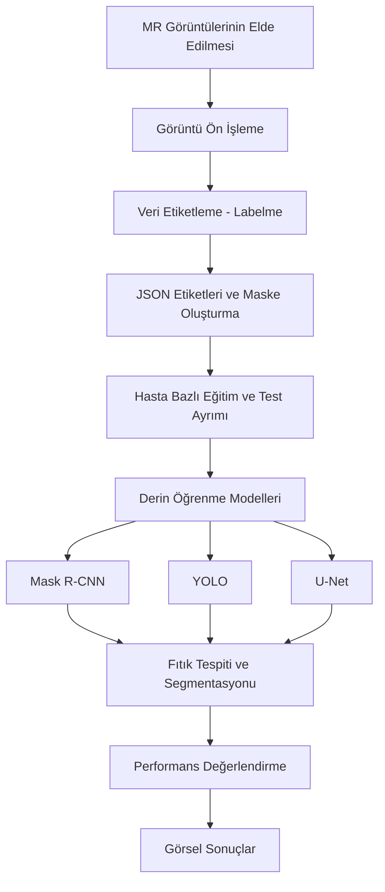

# Sistem Blok Şeması

## Yapay Zekâ ve Görüntü İşleme Tabanlı Bel Fıtığı Tespit ve Segmentasyon Sistemi

```mermaid
flowchart TD
    A["MR Görüntülerinin Elde Edilmesi"] --> B["Görüntü Ön İşleme"]
    B --> C["Veri Etiketleme - Labelme"]
    C --> D["JSON Etiketleri ve Maske Oluşturma"]
    D --> E["Hasta Bazlı Eğitim ve Test Ayrımı"]
    E --> F["Derin Öğrenme Modelleri"]

    F --> G["Mask R-CNN"]
    F --> H["YOLO"]
    F --> I["U-Net"]

    G --> J["Fıtık Tespiti ve Segmentasyonu"]
    H --> J
    I --> J

    J --> K["Performans Değerlendirme"]
    K --> L["Görsel Sonuçlar"]
```
